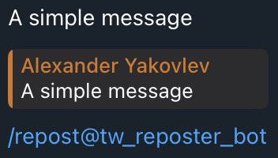
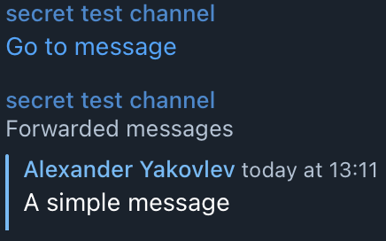

# Telegram Forwarding Bot (MVP)

This is a bot that allows forwarding messages from a group chat to a channel. It is designed to create some kind of knowledge base in the target channel and can keep track of hashtags.

## Overview

This bot is built on top of the [python-telegram-bot](https://github.com/python-telegram-bot/python-telegram-bot) library v20+.

The main use-case is simple message forwarding. Optionally, you can add hashtags in a simple way to mark your messages.

The bot uses TinyDB as a persistent storage for hashtags so that you can extract them later. It is extremely easy to use and requires just a `json` file to store data.

## Installation and configuration

This bot was developed and tested on Ubuntu 22.04 with Python v3.10.6.

To run the bot:

1. install two packages:

   * `pip install python-telegram-bot`
   * `pip install tinydb`

2. Create the `config.ini` file to store secret data with the following structure:

   ```
   [secrets]
   TELEGRAM_ACCESS_TOKEN = <token_value>
   SECRET_CHANNEL_ID = <target_channel_id>
   ```

3. Create an empty file named `db.json`. TinyDB will use it to store hashtags and their counters.

Note: Just like other bots that process messages, this bot should be admin both in source chat and target channel. You need to disable the privacy mode too.

## Usage

### Simple forwarding

To forward a message, reply to it with the `/repost` command. Each forwarded message is preceeded with another message that contains a link to the original message in the source chat. Thi is how it looks in the source chat:



The result in the target channel:



### Forwarding and adding hashtags

This command also accepts a list of space-separated words as optional arguments. Each argument should be a single word, and the following special symbols are prohibited: ```-_*[]()~`>#+=|{}.!```. The arguments are transformed to hashtags after forwarding. The bot adds the resulting hashtag list to the message with a link to the original message.

You can do it as follows:


The bot will send forward the message message :


